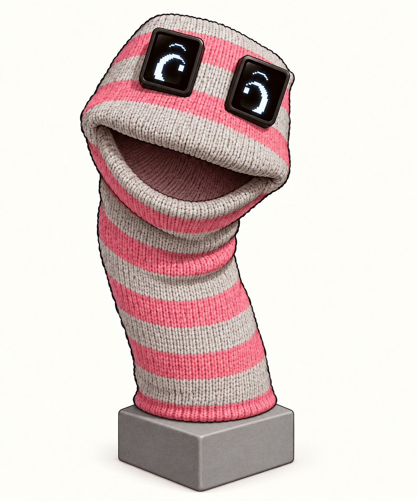
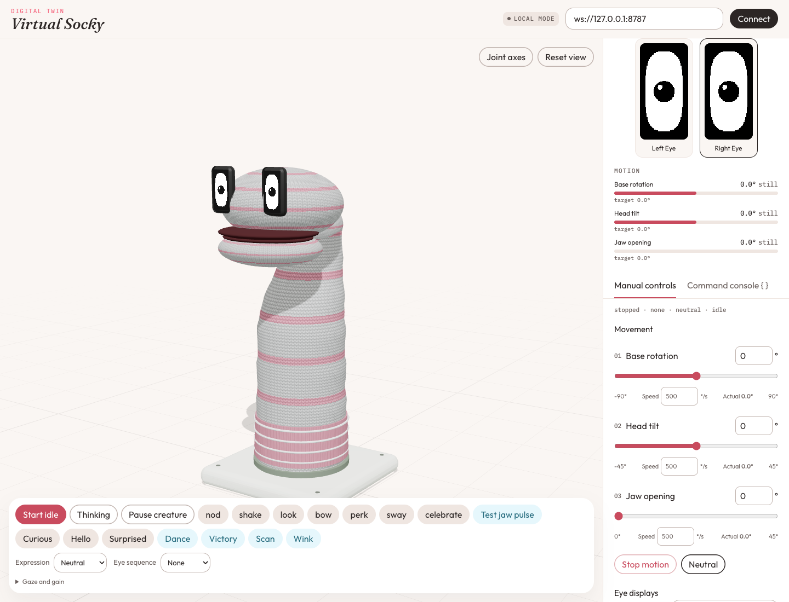

# Socky

HackMIT 2026 project archive.

Socky is a knitted sock puppet with a motorized head and two portrait OLED eyes. Hearing and speech stay on the computer. A shared creature runtime plays idle sway, gaze, blinks, expressions, and named moves such as nod, look, and dance. That runtime runs in the browser as Virtual Socky, and on the Arduino that drives the physical puppet.

Socky talks as a tutor for children ages 10–12: short sentences, one question at a time, and the occasional expression or gesture while speaking.



## What's in this repository

| Path | What it is |
| --- | --- |
| [`src/digital-twin`](src/digital-twin/README.md) | Virtual Socky. React and Three.js playground for the shared creature runtime. |
| [`src/puppeteer`](src/puppeteer/README.md) | Voice console, motion harness, and WebSocket or serial transport. |
| [`src/robot`](src/robot/README.md) | `@sock-puppet/robot`: protocol v2, eye renderer, move catalog, and simulator. |
| [`src/firmware`](src/firmware/README.md) | Arduino UNO Q sketch for three servos and both eyes. |
| [`src/oled-display-uno`](src/oled-display-uno/README.md) | Standalone UNO Q eye sketch the firmware eyes were taken from. |
| [`src/oled-display-esp`](src/oled-display-esp/README.md) | Standalone ESP32 eye sketch. |

Wire messages are in [protocol v2](src/robot/PROTOCOL.md). How speech, tools, and jaw motion stay in step is in the [voice architecture](src/puppeteer/docs/voice-architecture.md). A bench log from the hackathon is in the [verification record](src/puppeteer/docs/verification.md).

## Run Virtual Socky

Node.js 22.12+ and npm.

```sh
npm install
cp src/puppeteer/.env.example src/puppeteer/.env
```

Put an OpenAI API key in `src/puppeteer/.env` when you want Socky to talk. That file is gitignored. Without a key you can still drive the twin, send manual commands, and run the tests.

In two terminals:

```sh
npm run dev:twin
```

```sh
npm start
```

Open Virtual Socky at <http://127.0.0.1:5173> and connect it to `ws://127.0.0.1:8787`. Open the puppeteer at <http://127.0.0.1:8788>. If a USB board is plugged in, the puppeteer attaches to that serial port; choose **Digital twin · WebSocket** when you are driving Virtual Socky. Leave `npm run fixture` stopped. It uses the same robot port.



```sh
npm test
npm run build
npm run test:pty
npm run test:browser
```

## Physical puppet

The body is an Arduino UNO Q. Three hobby servos move base yaw (pin 9, home 90°), head pitch (pin 10, home 120°), and the jaw (pin 6, home 180° closed). Two SH1106 panels, 128×64 and mounted in portrait, are the eyes. Each panel keeps address `0x3C` on its own I2C bus.

Puppeteer runs the creature runtime on the computer and sends absolute targets such as `1,=,120,45`, plus named frames such as `eye,0,happy`. The jaw may open 30° from closed, and less when the head is fully down, so the mouth does not press into the body. The servos are open-loop: the board accepts commands and does not report measured shaft position. Gaze, continuous lids, raw pixels, and symbol modes stay on the host preview. Wiring, the text protocol, and how to flash the board are in the [firmware notes](src/firmware/README.md).

## Archive

This tree is the public snapshot of Socky from HackMIT 2026: Virtual Socky, the voice puppeteer, the shared robot package, the UNO Q firmware, and the standalone eye sketches. A classroom report view is on the `feat/teacher-portal` branch. API keys stay in the untracked `.env`.
